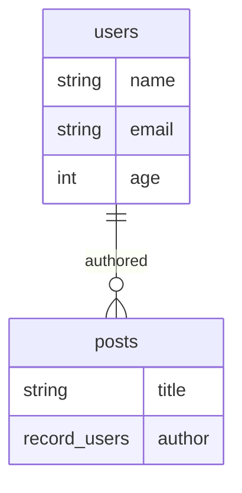

# Schema Visualization

surql can generate visual representations of your schema in multiple formats.

## Supported Formats

| Format | Function | Use Case |
|--------|----------|----------|
| Mermaid | `generateMermaid()` | GitHub, documentation, web |
| GraphViz | `generateGraphViz()` | PDF/SVG diagrams, tooling |
| ASCII | `generateAscii()` | Terminal output, quick review |

## Mermaid

```typescript
import { generateMermaid } from 'jsr:@oneiriq/surql'

const diagram = generateMermaid({
  tables: [userSchema, postSchema],
  edges: [authoredEdge],
})

console.log(diagram)
```

Output example:



## GraphViz

```typescript
import { generateGraphViz } from 'jsr:@oneiriq/surql'

const dot = generateGraphViz({
  tables: [userSchema, postSchema],
  edges: [authoredEdge],
  title: 'MyApp Schema',
})

// Write to file
await Deno.writeTextFile('schema.dot', dot)
```

Render with GraphViz:

```shell
dot -Tpng schema.dot -o schema.png
```

## ASCII

```typescript
import { generateAscii } from 'jsr:@oneiriq/surql'

const ascii = generateAscii({
  tables: [userSchema, postSchema],
  edges: [authoredEdge],
})

console.log(ascii)
```

Output example:

```
+----------+
|  users   |
+----------+
| name     | string
| email    | string
| age      | int
+----------+

Edges:
  authored: users -> posts
```

## Schema Validation

Before visualizing, validate your schema:

```typescript
import { validateSchema } from 'jsr:@oneiriq/surql'

const result = validateSchema({
  tables: [userSchema, postSchema],
  edges: [authoredEdge],
})

if (!result.valid) {
  result.issues.forEach((issue) => {
    console.error(`[${issue.level}] ${issue.message}`)
  })
}
```

Validation checks:

- Duplicate field names in the same table
- Record fields referencing unknown tables
- Indexes referencing unknown fields
- Edge `in`/`out` tables referencing unknown tables
- Table names that may not be valid SurrealDB identifiers

## Introspecting a Live Schema

Generate a visualization from a running SurrealDB instance:

```typescript
import { introspectSchema, generateMermaid } from 'jsr:@oneiriq/surql'

const schema = await introspectSchema(client)
const diagram = generateMermaid(schema)
console.log(diagram)
```

## Next Steps

- [Schema Definition](schema.md) - Define your schema in code
- [API Reference](api/index.md) - Full function reference
